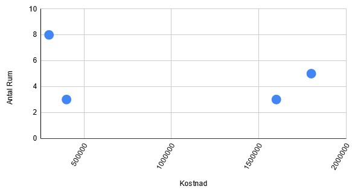
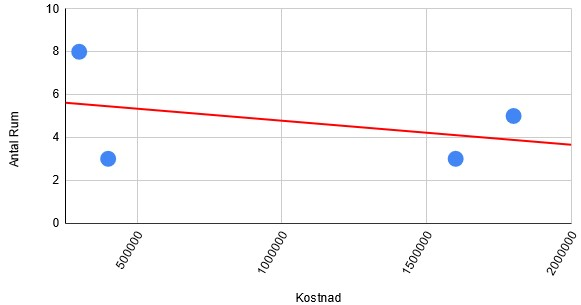

# Introduktion till AI - AI23
## Uppgift - Arbetsflöde för AI-projekt

### I den här uppgiften ska du teoretiskt beskriva dessa steg för ett scenario med maskininlärningsalgoritmen linjär regression. Scenariot är att förutspå huspriser baserat på olika ”features” såsom antalet rum, geografiska läget, storlek på huset med mera.
-------

- [x]  beskriv hur man kan göra för att samla in datan, vilka format, vart kan man spara datan?

Skulle jag själv skapa en databas från scratch om bostadsmarknaden hade jag försökt kartlägga och tabellsätta värden så som priser, plats, efterfrågan storlek och skick till en stor tabell. Som tur är behöver jag inte det! Sidor så som svensk mäklarstatistik (mot betalning) och booli (gratis!) hushåller och uppdaterar bostadsmarknadsdata i api-form, vilket är enkelt att hämta och ställa upp i tabeller eller liknande genom json-manipulering i allt från excel till kod.

- [x]  beskriv hur man kan visualisera datan?

Förutom dagens väldigt automatiserade och enkla lösningar i excel eller google sheets finns andra mer kodbaserade lösningar. Exempel på detta i Python är Pandas, Matplotlib, Seaborn eller Plottly, som ställer upp data i lättlästa grafer och tabeller.

- [x]  beskriv hur man kan göra för att bearbeta datan till rätt format?

Förhoppningsvis kan datan samlas in i rätt format redan från början, men ytterligare skulle man kunna "rena" datan genom att undersöka om datan innehåller tomma värden eller data som verkar vara långt utanför vad som är rimligt. Dessutom så behöver viss del av datan sparas avsides för att *användas för evaluering* av vår modell efter att modellen tränats på en majoritet av den insamlade datan.

- [x]  beskriv hur linjär regression fungerar.

Linjär regression är ett sätt att förutspå en utveckling av något utifrån flera variabler genom att matematiskt undersöka och värdera värden mot varandra. Om vi exempelvis skulle vilja förutspå hur huspriser skiljer sig kan nog de flesta tänka sig att ett stort hus i stan är dyrare än ett litet hus i skogen. Men är detta alltid sant? Genom att använda oss av linjär regression kan vi jämföra insamlad data, och på så vis rita upp och jämföra modeller som kollar på korrelationer mellan de olika trenderna. Fungerar modellen bra kan den sedan göra en kvalificerad gissning om ytterligare tillagda hus om ny husdata skulle tillsättas, och om hur framtida inkommande bostadsdata bör se ut beroende på endast vissa tillgängliga data.

Nedan följer ett enkelt exempel:

| Hus | Kostnad | Plats | Antal rum | Total yta
| -------- | -------- | -------- | -------- | -------- |
| 1 | 300 000 | Haparanda | 8 | 600
| 2 | 400 000 | Borås | 5 | 500
| 3 | 1 800 000 | Göteborg | 5 | 400
| 4 | 1 600 000 | Stockholm | 3 | 400

Vi kan direkt se att det är dyrare och mindre "värt" att bo i stora städer, men låt oss för tillfället enbart jämföra *Kostnad* och *Antal rum*. Se grafer.

I grafen ovan kan vi se hur de fyra husen förhåller sig till varandra, och nedan kan vi trenden i form av en linje som är uträknad med linjär regression utifrån angiven data.

Detta är ett exempel på **enkel** linjär regression, och ett exempel som kanske inte hade vart så användbar för att förutspå en framtida utveckling utan flera och historiska datapunkter!

**Multipel** eller **polynomial** linjär regression hade kanske vart mer aktuell för vårt exempel långsiktigt. Där flera "features" kan tas in för träning av vår modell, och som kan mer följsamt följa en trend.

- [x]  beskriv hur man kan göra för att driftsätta modellen?

I detta exempel skulle man kunna utveckla en app till exempelvis hemnet.se som utifrån användarens önskemål och budgeterade tidslinje kunna gissa sig till ungefär vilket sorts hus användaren har råd med, var någonstans i Sverige bostaden skulle kunna ligga samt när användaren skulle kunna ha råd med det. Eller varför inte en implementering för byggkoncerner där företag kan se vilken mark som är bäst att bygga på utefter vilka sorts bostäder människor i Sverige verkar söka efter, där storlek, område och prisområden skulle kunna får avgöra vad som byggs i framtiden.

- [x]  vilka teknologier kan man använda i de olika stegen i maskininlärningsprocessen?

Något som kan underlätta under själva maskininlärningsprocessen är att hjälpa och styra inlärningen under tiden modellen tränas. Förutom att modellen hela tiden behöver evalueras, behöver även våra parameterar justeras och *vägas om*. Alltså om vi upptäcker att *Antal rum* i exemplet ovan i själva verket inte alls verkar utvecklas till att vara lika viktigt som bostadens *Totala yta*. Antal rum är fortfarande ett värde vi räknar med, men vi skiftar vikten något så att Total yta får avgöra modellens lite mer. Riktningen på det röda strecket i bilden ovan hade kanske fortfarande haft en snarlik rikning, men hade förändrats litegrann. På så sätt och efter många justeringar får vi en mer precis modell.

Källor
- https://learn.microsoft.com/en-us/training/modules/understand-regression-machine-learning/
- https://docs.google.com/spreadsheets/
- https://www.maklarstatistik.se/svensk-maklarstatistiks-api-aggregerad-statistik/
- https://www.booli.se/p/api
- https://youtu.be/nKW8Ndu7Mjw (The 7 steps of machine learning, Google Cloud)